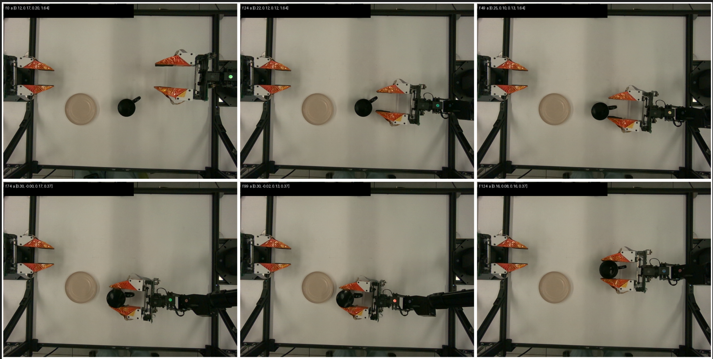
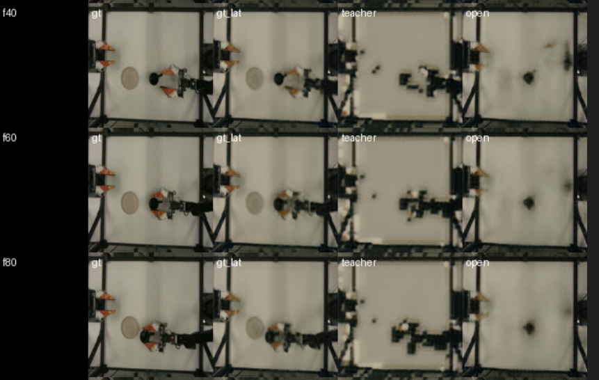
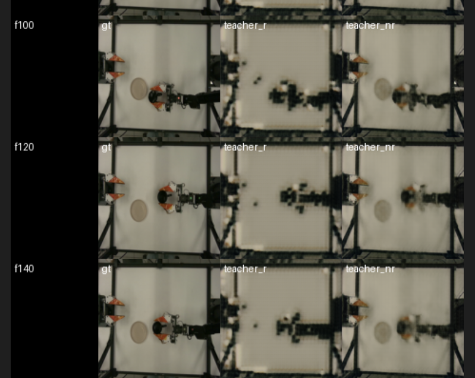

Step 0: Understanding everything about the dataset , images and actions

- Dataset: https://huggingface.co/datasets/yixuan1999/interactive-world-sim-data.
- Local starter setup is `task=single_grasp`, `split=val`, `camera=camera_1_color`.
- Will train primarily from `obs/images` plus `action`.
- For `single_grasp`, `action` is 4-D: `(x, y, z, gripper)`.
- `x, y, z` are absolute end-effector targets in the dataset world frame; gripper values are raw joint commands, with about `1.64 = open` and about `0.37-0.40 = closed`.
- Visualization script: `scripts/check/visualize_interactive_world_sim_data.py`

- First training-view video: `/tmp/interactive_world_sim_first_video.gif`

Step 1: Autoencoder training
Implemented a clean-room Stage-1 autoencoder training pipeline for `single_grasp`, `camera_1_color`, `128x128`.

- Model/training used a 1-view CNN encoder + consistency-style decoder with upstream-sized overlapping config: `latent_dim=512`, `hidden_channels=64`, `latent_channels=4`, batch size `32`.
- The latest clean resumed run was `outputs/stage1/single_grasp_overnight_upstream_sized_plateau_resume_final/`.
- It resumed from the latest saved checkpoint in `outputs/stage1/single_grasp_overnight_upstream_sized/checkpoints/last.pt` at step `5211`.
- The run stopped automatically on plateau at step `7500`.
- Plateau summary: best 500-step rolling loss `0.3527`; stopping window loss `0.3557`; stopped after `6` non-improving windows.
- Saved artifacts include `checkpoints/last.pt`, `checkpoints/step_007500.pt`, `samples/step_006429/episode_0.gif`, and `samples/step_007500/episode_0_grid.png`.

Step 2 & 3: Dynamics training & Inference

Open validation leads to too much drift

teacher forcing with no renorm is much closer to gt

