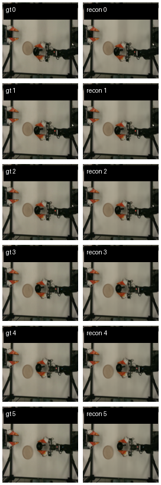
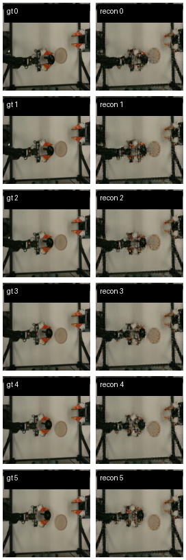
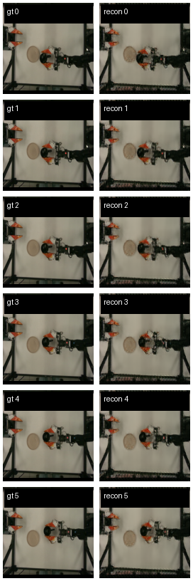
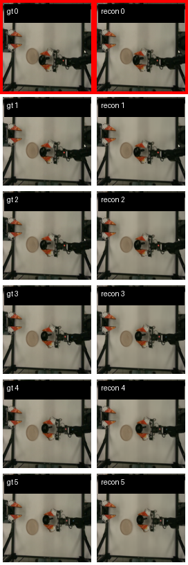
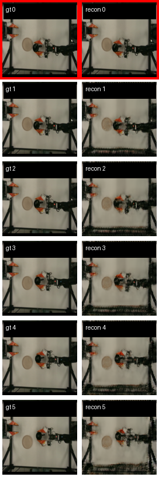

## Goal

Trying to overfit on 6 images from the dataset.

## Plan

Train on frames 111-116 of episode 0.
Train all 200 frames of episode 0.
Train on 10 episodes of the same task.
Train on 10 episodes of 10 same tasks, validation on 11th episode. From now one test and validation are separate.
Train on all episode of same task.
Train on X episodes of all tasks.

The model will change as it might not be good. After chaning it, an overfit of the 6 frames will always be done.

## Stable finidngs
- vae_only and then dynamics_only works better than joint training.
-  the encoder is just two stride-2 conv downsamples into a 32x32x4 map, and the decoder is a symmetric transpose-conv stack with only pixel reconstruction pressure plus next-frame pixel MSE . this works with the same test and validation data but it diverges with different test and validation data.

## Frames 111-116 of episode 0

### Image encoder and decoder

The encoding and decoding of the 6 images worked: 

If I horizontally flip everything gets destroyed:

If all the images are shifted 5 pixels up the reconstruction is good but slightly blurry:

### Dynamics

With normal images the open rollout looks good:

With the images shifted up the rollout bad but works:

Training from scratch with joint rollout, encoder - dynamics - decoder it is blurry. It is better to train the autoencoder first and then train the dynamics.

